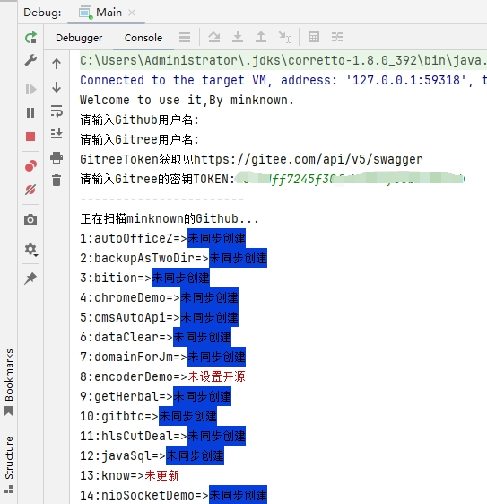

# gitSync
## 在Github和Gitee上同步仓库的辅助脚本工具 -基于JAVA开发  
<我的Github\Gitee密码：Ww***075*8***!（账号是QQ邮箱）  
  
由于需要，我需要在Github的资料同步到Gitee.官方支持导入的，但是无法批量设置开源，也无法自动更新仓库内容。  
所以，我创建了该脚本，可以检测您在Github上的所有仓库，哪个仓库没有存在于Gitee，也可以检测哪个仓库未设置公开开源，以及Github的仓库更新了，Gitee的哪些仓库未进行及时更新。  
**运行环境：jre1.8即可**  
**关于Github这边，无需进行TOKEN授权，仅使用了一个API-URL开放式接口。**  
**关于GitTee这边，需进行TOKEN授权，使用了一个API：https://gitee.com/api/v5/swagger#/getV5ReposOwnerRepo**  
关于GitTeeToekn的获取方法：https://gitee.com/api/v5/swagger  
（打开后点击右上角按钮获取即可）  

我将JAR包，以及main源码，tools源码，以及maven-POM依赖共享出来，没错这个工具是开源的。   
视频功能演示和教程：https://github-minknown.oss-cn-beijing.aliyuncs.com/gitsync.mp4  
附图：  

